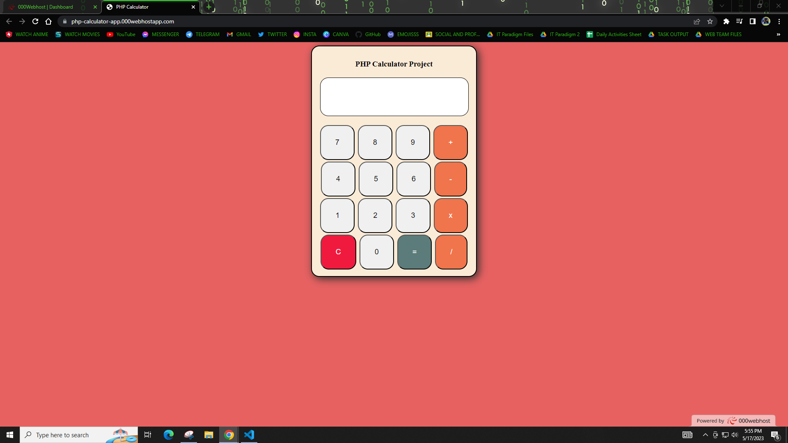

# EvaluTest (Online Examination System)

> This is a simple PHP Calculator App that was developed using only HTML, CSS, and PHP.
> 
> This calculator app can  be used to calculate simple mathematical problems such as addition, subtraction, multiplication, and division.
> 
> Website Link: *[https://php-calculator-app.000webhostapp.com/](https://php-calculator-app.000webhostapp.com/)*

 
